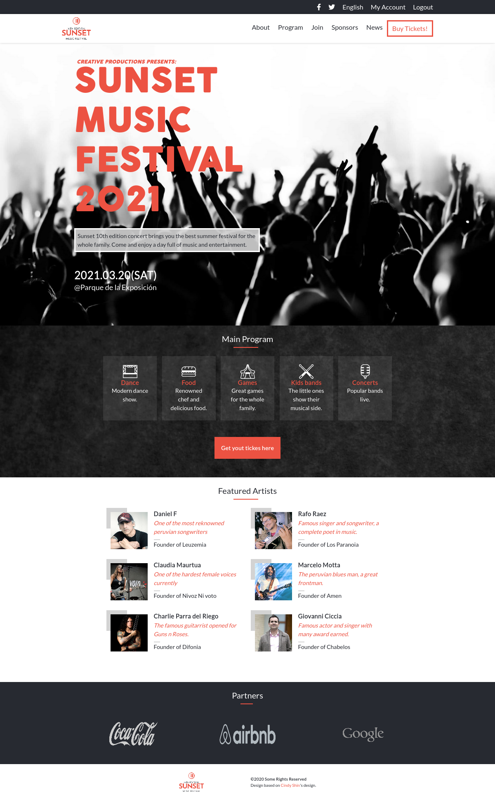

# Sunset Festival Concert

This project is created for the Microvese HTML and CSS capstone.
Is a webpage for information and purchase of tickets for the Sunset Festival.
All info used here is fictional.

For this project SASS was used as the preprocessor to implement a modular workflow in the styling.

## Built With

- HTML5
- SASS
- Bootstrap 5

## Live Demo

[Live Demo Link](https://jadx2.github.io/concert_capstone/)

## Authors

👤 **Author1**

- GitHub: [@jadx2](https://github.com/jadx2)
- Twitter: [@thecatcodes](https://twitter.com/thecatcodes)

## 🤝 Contributing

Contributions, issues, and feature requests are welcome!

Feel free to check the [issues page](https://github.com/jadx2/concert_capstone/issues).

## Show your support

Give a ⭐️ if you like this project!

## Acknowledgments

This project was build based on [Cindy Shin's design.](https://www.behance.net/gallery/29845175/CC-Global-Summit-2015)

